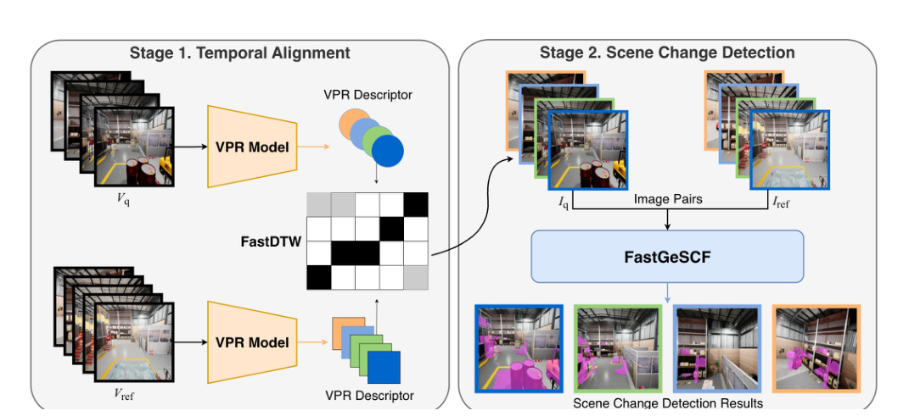
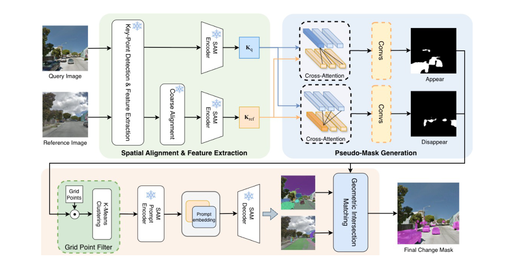
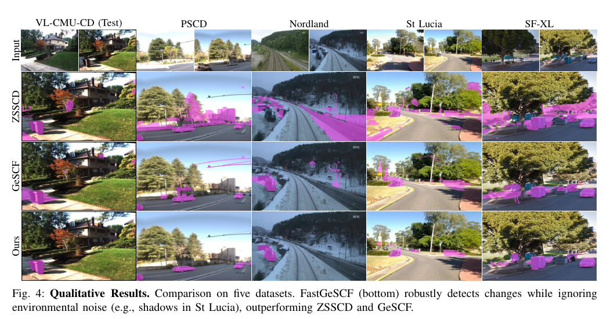

# FastGeSCF
 [](docs/IROS26_0406_FI.pdf)

> [▶ Watch the FastGeSCF video demo on YouTube](https://youtu.be/LR8ljWB3qnA)


FastGeSCF is a fast scene change detection framework for unaligned robot videos. It follows the paper **Towards Practical Scene Change Detection: A Fast, Unaligned Video Framework via Spatiotemporal Alignment**, combining temporal video alignment with efficient SAM-based change-mask generation.



## Overview

The project has two stages:

1. Temporal alignment pairs frames from repeated traversals using SALAD visual place recognition descriptors and FastDTW sequence matching.
2. FastGeSCF detects scene changes on each aligned pair using LightGlue spatial registration, SAM features, a cross-attention pseudo-mask generator, and a grid point filter that prompts SAM only in likely changed regions.

In the paper, FastGeSCF reaches the highest average F1 across the reported SCD benchmarks while reducing average inference time to **0.888 s/pair**, about **7.9x faster** than GeSCF.



## Paper Results

| Method | VL-CMU-CD | PSCD | Nordland | St Lucia | SF-XL | Avg F1 | Time (s) |
| --- | ---: | ---: | ---: | ---: | ---: | ---: | ---: |
| GeSCF | 0.754 | 0.540 | 0.590 | 0.621 | 0.712 | 0.643 | 6.982 |
| ZSSCD | 0.516 | 0.440 | 0.230 | 0.470 | 0.496 | 0.430 | 10.128 |
| FastGeSCF | 0.760 | 0.526 | 0.542 | 0.726 | 0.736 | 0.658 | 0.888 |



See [docs/PAPER.md](docs/PAPER.md) for more paper context, temporal-alignment results, ablations, and citation information.

## Repository Layout
```text
assets/paper/             Cropped figures and results from the paper
experiments/              Runnable experiment entry points
model/                    FastGeSCF change-detection model
datasets/                 Dataset loaders and preprocessing helpers
sam2/                     Vendored SAM2 runtime used by FastGeSCF
LightGlue/                External LightGlue checkout, ignored by git
salad/                    Vendored SALAD VPR model code
py_utils/                 Evaluation, VPR, and visualization utilities
checkpoints/              Local checkpoint directory, ignored except download script
docs/EXPERIMENTS.md       Detailed experiment commands and dataset path setup
scripts/                  Smoke checks and local validation helpers
```

## Environment

Create the environment from the provided Conda file, then install Python requirements if needed:

```bash
conda env create -f env.yml
conda activate vcd
pip install -r requirements.txt
```

The current local validation was run with Python 3.11.

## External Dependencies

LightGlue is maintained by another project and is intentionally not committed here. Clone it into the repository root before running FastGeSCF registration or inference:

```bash
git clone https://github.com/cvg/LightGlue.git LightGlue
```

The code imports it as `LightGlue.lightglue`, so the checkout directory should be named `LightGlue`.

## Checkpoints

Download SAM2.1 checkpoints:

```bash
bash checkpoints/download_ckpts.sh
```

Download the FastGeSCF trained weights from the GitHub release:

https://github.com/Henryeh310101/FastGeSCF/releases/tag/weights-v1

```bash
mkdir -p results/RobustViT_vl-cmu-cd results/RobustViT_changesim

curl -L \
  -o results/RobustViT_vl-cmu-cd/best_model.pth \
  https://github.com/Henryeh310101/FastGeSCF/releases/download/weights-v1/FastGeSCF_RobustViT_vl-cmu-cd_best_model.pth

curl -L \
  -o results/RobustViT_changesim/best_model.pth \
  https://github.com/Henryeh310101/FastGeSCF/releases/download/weights-v1/FastGeSCF_RobustViT_changesim_best_model.pth
```

After downloading, the trained weights should be available at:

```text
results/RobustViT_vl-cmu-cd/best_model.pth
results/RobustViT_changesim/best_model.pth
```

Large checkpoints and generated result folders are ignored by git. Use CLI flags such as `--sam2_checkpoint`, `--outdoor_ckpt`, and `--indoor_ckpt` to point to files stored elsewhere.

## Quick Validation

```bash
bash scripts/run_local_checks.sh
```

This compiles the project modules and checks all experiment CLIs.

Dry-run an experiment against local data without loading heavy models:

```bash
python experiments/train.py --dataset vl-cmu-cd --data_root /path/to/VL-CMU-CD-binary255 --dry_run
python experiments/evaluate_datasets.py --datasets SF-XL --data_root /path/to/SF-XL --dry_run
```

## Common Runs

Single image pair:

```bash
python experiments/infer_pair.py --t0 /path/to/t0.png --t1 /path/to/t1.png --gt /path/to/mask.png
```

Dataset evaluation:

```bash
python experiments/evaluate_datasets.py --datasets SF-XL --data_root /path/to/SF-XL
```

Training:

```bash
python experiments/train.py --dataset vl-cmu-cd --data_root /path/to/VL-CMU-CD-binary255
```

Temporal alignment:

```bash
python experiments/temporal_alignment.py --base /path/to/Query_Seq_Test --env dust
```

Video change detection:

```bash
python experiments/video_change_detection.py --query_dir /path/to/query_frames --ref_dir /path/to/reference_frames
```

See [docs/EXPERIMENTS.md](docs/EXPERIMENTS.md) for the full runnable command set.

## Citation

```bibtex
@inproceedings{yeh2026fastgescf,
  title = {Towards Practical Scene Change Detection: A Fast, Unaligned Video Framework via Spatiotemporal Alignment},
  author = {Yeh, Yi-Heng and Huang, Chuan-Yuan and Chen, Kuan-Wen and Lu, Li-Yu},
  booktitle = {IEEE/RSJ International Conference on Intelligent Robots and Systems (IROS)},
  year = {2026}
}
```

## License Notes

This repository includes vendored third-party code. See [THIRD_PARTY_NOTICES.md](THIRD_PARTY_NOTICES.md) and the license files inside vendored directories.
