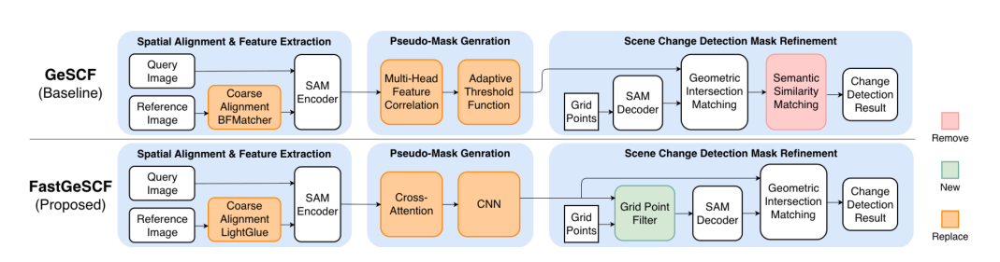
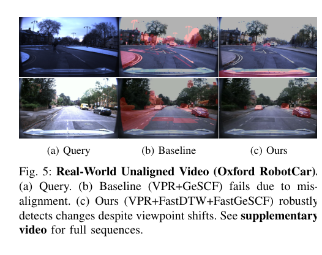

# Paper Summary

This repository implements the framework described in **Towards Practical Scene Change Detection: A Fast, Unaligned Video Framework via Spatiotemporal Alignment**.


## Method

FastGeSCF targets scene change detection for repeated robot traversals where image pairs are not perfectly aligned in time or viewpoint.

The pipeline has two stages:

1. **Temporal alignment:** SALAD visual place recognition descriptors are extracted for query and reference videos, then FastDTW enforces sequence-level temporal consistency to pair frames.
2. **Scene change detection:** LightGlue handles spatial registration between paired frames. FastGeSCF then uses SAM features, cross-attention pseudo-mask generation, and a grid point filter to reduce redundant SAM prompting.


The structural difference from GeSCF is that FastGeSCF inserts a learned pseudo-mask path before SAM mask refinement, then uses the pseudo-mask to filter and cluster prompt points.



## Quantitative Results

F1-score and average inference time per image pair from the paper:

| Method | VL-CMU-CD | PSCD | Nordland | St Lucia | SF-XL | Avg F1 | Time (s) |
| --- | ---: | ---: | ---: | ---: | ---: | ---: | ---: |
| GeSCF | 0.754 | 0.540 | 0.590 | 0.621 | 0.712 | 0.643 | 6.982 |
| ZSSCD | 0.516 | 0.440 | 0.230 | 0.470 | 0.496 | 0.430 | 10.128 |
| FastGeSCF | 0.760 | 0.526 | 0.542 | 0.726 | 0.736 | 0.658 | 0.888 |


## Temporal Alignment

Recall@K on ChangeSim using Normal as query and Dark/Dust as references. A retrieval is counted as correct when the pose error is below 1 m.

| Method | Query | Reference | R@1 | R@5 | R@10 |
| --- | --- | --- | ---: | ---: | ---: |
| VPR Only | Normal | Dark | 0.3443 | 0.4950 | 0.5627 |
| VPR Only | Normal | Dust | 0.4955 | 0.6244 | 0.6839 |
| VPR + FastDTW | Normal | Dark | 0.4592 | 0.4974 | 0.5464 |
| VPR + FastDTW | Normal | Dust | 0.6164 | 0.6585 | 0.6905 |

Impact of the pairing strategy on ChangeSim SCD F1:

| Pairing Strategy | Normal | Dust | Dark |
| --- | ---: | ---: | ---: |
| GT Pair | 0.5400 | 0.4790 | 0.4010 |
| VPR Only | 0.4900 | 0.4866 | 0.4063 |
| VPR + FastDTW | 0.5030 | 0.4900 | 0.4133 |

## Runtime Ablation

Average latency per image pair:

| Method Configuration | Pseudo-Mask (s) | Refinement (s) | Total Latency (s) |
| --- | ---: | ---: | ---: |
| GeSCF baseline | 0.030 | 5.653 | 6.982 |
| GeSCF + grid point filter | 0.030 | 2.820 | 4.149 |
| FastGeSCF | 0.176 | 0.529 | 0.888 |

The cross-attention pseudo-mask is slightly more expensive than GeSCF's correlation map, but it removes enough redundant prompts to reduce the dominant SAM refinement stage.

## Real-World Video

The paper also evaluates an unaligned Oxford RobotCar sequence. The VPR+GeSCF baseline suffers from viewpoint shifts, while VPR+FastDTW+FastGeSCF produces cleaner change masks.



Supplementary video link from the paper: https://youtu.be/d1J3pL_wxRw

## Citation

```bibtex
@inproceedings{yeh2026fastgescf,
  title = {Towards Practical Scene Change Detection: A Fast, Unaligned Video Framework via Spatiotemporal Alignment},
  author = {Yeh, Yi-Heng and Huang, Chuan-Yuan and Chen, Kuan-Wen and Lu, Li-Yu},
  booktitle = {IEEE/RSJ International Conference on Intelligent Robots and Systems (IROS)},
  year = {2026}
}
```
